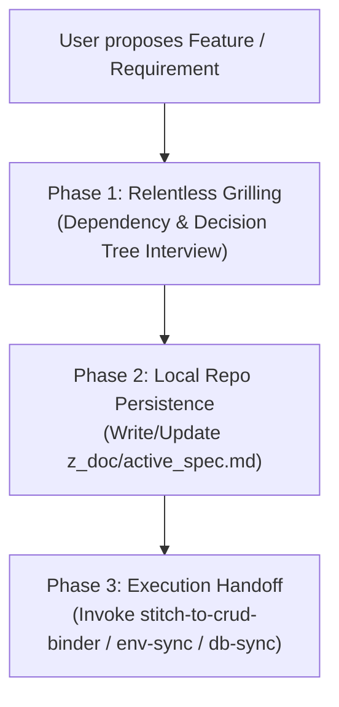

# 🎯 App Grill Planner Skill (`app-grill-planner`)

Use this skill whenever you are **planning a new feature, refactoring an existing module, or modifying app requirements**. 

This skill shifts the AI dynamic from "blind coding" into a **disciplined systems architect** who stress-tests your plan through an interactive interview and **persists the verified requirements into the local repository** to survive chat resets and long iterations.

---

## 🛑 The Core Problem: Context Amnesia

When chatting with AI across long sessions or new chats, conversational memory is lost. To prevent hallucination and regressions:
1. **Requirements MUST be captured in the repository (`z_doc/active_spec.md`)**.
2. **Code is ONLY written after the spec is frozen and approved**.

---

## 📋 3-Phase Operational Workflow



---

### Phase 1: The Relentless Grill (深度需求盤問)

When invoked, the AI must NOT write code immediately. It must interview the user across 5 critical dimensions:

1. **User Flow & UI Lifecycle**:
   - What triggers this action?
   - What happens during Loading, Error, Empty, and Success states?
2. **Data & Neon DB Schema**:
   - Which table and columns are touched? Are new columns (with types, defaults, nullable) required?
3. **API & Contract Layer**:
   - REST endpoint path (`POST /api/...`), request payload, response structure.
4. **Third-Party & Security**:
   - Does this touch Stripe (Freemium gating/Webhooks), Cloudflare R2 (storage upload/cleanup), or Neon Auth (user permission/RLS)?
5. **Edge Cases & Failure Handling**:
   - What happens on network disconnect? Duplicate submissions? Missing required fields?

> 💡 **Interview Rule**: Ask 2-3 focused questions at a time in structured bullet points, providing recommended defaults whenever possible.

---

### Phase 2: Local Repo Spec Persistence (寫入本地規格書)

Once questions are resolved, write/update the canonical specification file at:
`z_doc/active_spec.md`

#### Standard `active_spec.md` Structure:
```markdown
# 📋 Feature Specification: [Feature Name]
> **Status**: [Draft / Approved / In-Progress / Completed]
> **Last Updated**: YYYY-MM-DD
> **Target Module**: [frontend / backend / database]

## 1. 業務需求與用戶旅程 (User Journey)
- 描述功能背景、觸發條件與操作流程。

## 2. 資料庫綱要異動 (Neon DB Schema)
- 表名與欄位清單 (含 Type, Nullable, Default, Index)。

## 3. API 契約 (Endpoint Contract)
- `METHOD /api/path`
- Request Body (JSON)
- Response Body (JSON)

## 4. 前端 UI 狀態與異常處理 (UI & Error States)
- Loading Skeleton: ...
- Error Handling (Toast/Banner): ...
- Empty State: ...

## 5. 關鍵架構決策 (Architectural Decisions / ADR)
- 記錄為何採用方案 A 而非方案 B，防止日後重複討論。
```

---

### Phase 3: Execution Handoff (一鍵調用其他 Skills 執行)

Once `z_doc/active_spec.md` is approved by the user:
1. Call **`db-sync`** to apply database migrations if needed.
2. Call **`stitch-to-crud-binder`** to bind the Stitch React UI to real APIs.
3. Call **`env-sync`** if new environment variables are introduced.
4. Call **`zdoc-maintainer`** to log the milestone into `z_doc/development_log.md`.
