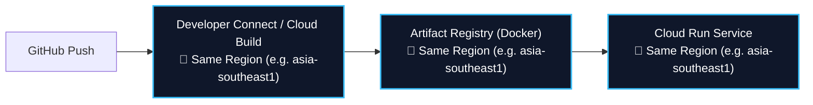

# 🚀 GCP Cloud Run Zero-Egress Provisioner (`gcp-cloudrun-provisioner`)

Use this skill whenever:
1. A **new GCP Project** is created and needs its first Cloud Run service and Docker repository provisioned.
2. An existing GCP Project has **no services yet**, and a brand new Cloud Run service needs to be created from scratch.
3. Setting up **GitHub CI/CD triggers** (Developer Connect / Cloud Build) without cross-region egress data transfer fees.
4. Auditing existing GCP resources to eliminate cross-region "ghost" billing.

---

## 🏛️ 1. 核心原則：同區三位一體 (Same-Region Trinity)

在 Google Cloud Platform 上，容器映像檔（Docker Image）通常達幾百 MB。若構建、存放與運行散落在不同區域，每次部署都會觸發**跨洋網絡傳輸費（Inter-region Egress Fee）**。

因此，所有操作**必須且強制**遵循「同區三位一體」鐵律：



| 元件 | 職責 | 區域規定 |
| :--- | :--- | :--- |
| **Cloud Run** | 容器計算與對外 HTTPS 端點 | **必須完全一致**（例：`asia-southeast1`） |
| **Artifact Registry** | 存放容器映像檔 (Docker Repository) | **必須完全一致**（例：`asia-southeast1`） |
| **Cloud Build / Trigger** | 接收 GitHub Webhook、編譯並推送 Image | **必須完全一致**（例：`asia-southeast1`） |

> **零扣費保證**：當三者位於同一 Region，所有 Image 上傳與拉取均走 Google 內部高速 VPC，跨區傳輸費用為 **$0**。

---

## 🛠️ 2. 場景 A：全新 Project，從零建立第一個 Cloud Run 服務 (Zero-to-One)

如果用戶剛建立了 GCP Project（已綁定 Billing），但**裡面空空如也，完全沒有任何 Service**，Agent 可直接按以下標準命令全自動開設：

### 步驟 1：鎖定專案與預設區域 (Region Lock)
```bash
# 1. 綁定目標專案 ID
gcloud config set project <PROJECT_ID>

# 2. 鎖定全域預設區域（預設建議：asia-southeast1 新加坡）
gcloud config set run/region asia-southeast1
gcloud config set artifacts/location asia-southeast1
```

### 步驟 2：一鍵啟用必要 GCP API
```bash
gcloud services enable \
  run.googleapis.com \
  artifactregistry.googleapis.com \
  cloudbuild.googleapis.com \
  developerconnect.googleapis.com
```

### 步驟 3：在同區建立 Docker 存放庫
```bash
gcloud artifacts repositories create <REPO_NAME> \
  --repository-format=docker \
  --location=asia-southeast1 \
  --description="Docker repository for Cloud Run services"
```

### 步驟 4：同區建構 Docker 映像檔並推送
```bash
# 在代碼目錄下執行（自動由同區 Cloud Build 編譯並存入同區 Artifact Registry）
gcloud builds submit \
  --region=asia-southeast1 \
  --tag=asia-southeast1-docker.pkg.dev/<PROJECT_ID>/<REPO_NAME>/<SERVICE_NAME>:latest
```

### 步驟 5：從零開設全新 Cloud Run 服務
```bash
gcloud run deploy <SERVICE_NAME> \
  --image=asia-southeast1-docker.pkg.dev/<PROJECT_ID>/<REPO_NAME>/<SERVICE_NAME>:latest \
  --region=asia-southeast1 \
  --platform=managed \
  --allow-unauthenticated \
  --port=8080 \
  --memory=512Mi \
  --cpu=1 \
  --min-instances=0 \
  --max-instances=5
```
> 執行完畢後，終端會直接返回全新的公開 HTTPS 網址（例如 `https://<SERVICE_NAME>-xxx.asia-southeast1.run.app`）。

---

## 🔄 3. 場景 B：建立自動化 GitHub CI/CD Trigger

若用戶希望「每次 push GitHub 自動部署 Cloud Run」：

### ⚠️ 防坑禁忌：
**絕對不要**在 Cloud Run 網頁控制台點擊「設定持續部署」一鍵精靈，因為精靈預設會將 Trigger 偷設在 `europe-west1` 或 `us-central1`！

### ✅ 正確標準步驟：
1. **GitHub 連線授權 (Developer Connect)**：
   - 用戶需在 GCP Console > **Developer Connect** 點選一次授權，授權 GitHub 帳號並**手動選擇區域為 `asia-southeast1`**。
2. **建立同區 Trigger**：
   ```bash
   gcloud builds triggers create github \
     --region=asia-southeast1 \
     --name="<SERVICE_NAME>-trigger" \
     --repo-owner="<GITHUB_USER>" \
     --repo-name="<REPO_NAME>" \
     --branch-pattern="^main$" \
     --build-config="cloudbuild.yaml"
   ```
3. **標準零幽靈費用 `cloudbuild.yaml` 範本**：
   ```yaml
   steps:
     # 1. 編譯 Docker 容器
     - name: 'gcr.io/cloud-builders/docker'
       args: [
         'build',
         '-t', 'asia-southeast1-docker.pkg.dev/$PROJECT_ID/<REPO_NAME>/<SERVICE_NAME>:$COMMIT_SHA',
         '.'
       ]
     # 2. 推送到同區倉庫
     - name: 'gcr.io/cloud-builders/docker'
       args: [
         'push',
         'asia-southeast1-docker.pkg.dev/$PROJECT_ID/<REPO_NAME>/<SERVICE_NAME>:$COMMIT_SHA'
       ]
     # 3. 部署到同區 Cloud Run
     - name: 'gcr.io/google.com/cloudsdktool/cloud-sdk'
       entrypoint: gcloud
       args: [
         'run', 'deploy', '<SERVICE_NAME>',
         '--image', 'asia-southeast1-docker.pkg.dev/$PROJECT_ID/<REPO_NAME>/<SERVICE_NAME>:$COMMIT_SHA',
         '--region', 'asia-southeast1'
       ]
   images:
     - 'asia-southeast1-docker.pkg.dev/$PROJECT_ID/<REPO_NAME>/<SERVICE_NAME>:$COMMIT_SHA'
   options:
     defaultLogsBucketBehavior: REGIONAL_USER_OWNED_BUCKET
   ```

---

## 🛡️ 4. Day 1 必備安全網：$1 美元預算警報 (Budgets & Alerts)

在新專案啟動時，立即指導或執行建立微額預警，防範未然：
1. 前往 GCP Console: **Billing (結算) > Budgets & alerts (預算與警告)**。
2. 建立新預算：
   - 名稱：`Anti-Ghost-Spend-Alert`
   - 目標金額：**$1.00 USD** (或 $5.00 USD)
   - 警報觸發點：實際支出達到 50% ($0.5)、90% ($0.9) 或 100% ($1.0) 時，立即發送 Email 通知。
3. 一旦有任何異常跨區流量或忘記釋放的付費實例，幾分鐘內即可在信箱捕獲，杜絕月末天價帳單。

---

## 🔍 5. 跨區幽靈資源審計速查表 (Audit Checklist)

如果用戶懷疑現有專案有跨區扣費，依序執行以下指令進行體檢：
```bash
# 檢查所有 Cloud Run 服務所在的 Region
gcloud run services list --format="table(metadata.name,region)"

# 檢查所有 Artifact Registry 倉庫所在的 Region
gcloud artifacts repositories list --format="table(name,format,location)"

# 檢查所有 Cloud Build Triggers 所在的 Region
gcloud builds triggers list --region=global
gcloud builds triggers list --region=asia-southeast1
gcloud builds triggers list --region=europe-west1
gcloud builds triggers list --region=us-central1
```
> 若發現任何 Trigger 或 Repo 不在主服務所在的 Region（如新加坡 `asia-southeast1`），必須立即重新建立並刪除舊有的跨區資源！
