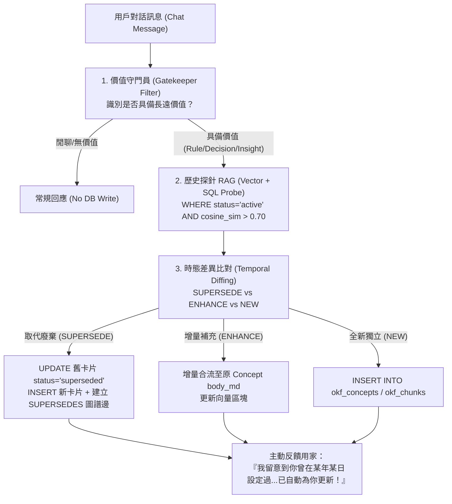

# 🧠 Google OKF 對話記憶與時態圖譜進化技能 (`okf-dialogue-memory`)

Use this skill whenever you need to **extract, distill, verify, or evolve dynamic knowledge from conversational dialogues** into the persistent Google Open Knowledge Format (OKF v0.2) schema on PostgreSQL (Neon DB).

Unlike static document ingestion (`okf-knowledge-builder`), this skill operates as a **bi-directional living memory loop**:
1. **Listens**: Captures durable insights, facts, policies, and architecture decisions from raw chat.
2. **Probes**: Uses hybrid SQL + HNSW Vector search to check if a related concept already exists in history.
3. **Temporal Diffing**: Detects whether the new input updates, refines, or directly contradicts a past decision made on a specific date (e.g. 2026-03-15 vs today).
4. **Graph Linking & Archiving**: Marks obsolete cards as `superseded`, inserts new concept versions, and stitches `SUPERSEDES` links with timestamped change logs.

---

## 🏗️ 1. Architecture: How it leverages OKF + RAG

This skill **is a textbook application of OKF + Hybrid RAG**, combining both for maximum efficiency:



---

## ⚙️ 2. The 4-Step Standard Operating Procedure (SOP)

### Step 1: 價值守門員過濾 (Gatekeeper Filtering)
Before hitting any expensive embedding or DB writes, evaluate if the message qualifies:
- **放行類別**：
  1. 業務、產品或架構規則（例如：*「退款期限改為 14 天」*、*「專案改用 Cloud Run 部署」*）
  2. 用戶個人長期偏好或設定
  3. 問題除錯根因與最佳實踐結論
  4. 用戶顯式指令（例如：*「記低佢」*、*「Mark 落筆記」*）
- **攔截類別**：日常問候、情緒抱怨、純程式碼複製、暫態問題。

### Step 2: 歷史反向探針 (Historical RAG Probe)
Generate a 768-dim embedding for the extracted insight and query Neon DB with hard SQL filters:
```sql
-- 毫秒級定位語意相近且當前有效的舊概念
SELECT 
    c.concept_id, 
    c.title, 
    c.created_at, 
    c.body_md,
    1 - (k.embedding <=> $1::vector) AS similarity
FROM okf_chunks k
JOIN okf_concepts c ON k.concept_id = c.concept_id
WHERE c.course_id = $2
  AND c.status = 'active'
ORDER BY similarity DESC
LIMIT 3;
```

### Step 3: 時態差異判定 (Temporal Diffing)
Compare the historical candidate with current input using the 4-decision matrix in `references/diff-classification-rules.md`:
- **`SUPERSEDE`**：新規則推翻舊規則 ➡️ 標記舊卡片 `valid_until = NOW()`, `status = 'superseded'`, `superseded_by = <新卡片ID>`。在 `okf_links` 建立邊：`source = 新卡片, target = 舊卡片, link_type = 'SUPERSEDES'`。
- **`ENHANCE`**：補充既有知識 ➡️ 在既有卡片追加章節並更新 embedding。
- **`NEW_INDEPENDENT`**：相似度低於門檻 ➡️ 建立全新概念卡片。

### Step 4: 對話透明反饋 (Proactive Confirmation)
When generating the final answer to the user, include a natural, transparent mention of the memory operation:
> *「收到！我留意到在 **YYYY-MM-DD** 曾有過【舊規則】的記錄，現已為你自動更新為【新規則】，並在知識圖譜中歸檔歷史版本！✅」*

---

## 🛡️ 3. Safety & Cost-Efficiency Principles

1. **零全庫掃描 (No Table Scans)**：強制透過 `status = 'active'` 與 B-Tree 索引篩選，查詢時間保持在 **10~30ms** 內。
2. **防記憶膨脹 (Anti-Bloat)**：閒聊與臨時問答 100% 阻絕於向量庫之外，維持 OKF 圖譜的最高純度。
3. **可追溯性 (Full Audit Trail)**：舊知識從不物理刪除（Soft Deprecate），隨時可透過 `okf_links` 還原某項政策在歷史不同時期的演進時間軸。
