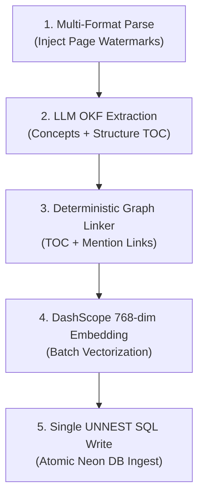

# 🧠 Google OKF Knowledge Builder Skill (v0.2 Standard)

Use this skill whenever you need to **design, build, deploy, or execute an end-to-end Knowledge Ingestion & Graph RAG Engine** adhering 100% to the official Google Open Knowledge Format (OKF v0.2) and PostgreSQL (Neon DB) with pgvector.

---

## 🏗️ 1. Complete Neon DB Architecture (DDL Schema)

When setting up or verifying the database, apply the canonical schema located at `.agents/skills/okf-knowledge-builder/references/okf_schema.sql`:

```sql
-- 1. Enable Extensions
CREATE EXTENSION IF NOT EXISTS "uuid-ossp";
CREATE EXTENSION IF NOT EXISTS "vector";

-- 2. OKF Concepts (Single source of truth for concept cards)
CREATE TABLE IF NOT EXISTS public.okf_concepts (
    uid UUID PRIMARY KEY DEFAULT gen_random_uuid(),
    concept_id VARCHAR(255) NOT NULL UNIQUE,
    course_id VARCHAR(50) NOT NULL,
    title VARCHAR(255) NOT NULL,
    type VARCHAR(50) NOT NULL, -- 'Structure', 'Concept', 'Rule', 'Process', 'Standard'
    frontmatter JSONB NOT NULL DEFAULT '{}'::jsonb,
    body_md TEXT NOT NULL,
    created_at TIMESTAMPTZ DEFAULT NOW(),
    updated_at TIMESTAMPTZ DEFAULT NOW()
);

-- 3. OKF Links (Bidirectional semantic & structural graph edges)
CREATE TABLE IF NOT EXISTS public.okf_links (
    id UUID PRIMARY KEY DEFAULT gen_random_uuid(),
    course_id VARCHAR(50),
    source_concept_id VARCHAR(255) NOT NULL REFERENCES public.okf_concepts(concept_id) ON DELETE CASCADE,
    target_concept_id VARCHAR(255) NOT NULL,
    link_text VARCHAR(255),
    created_at TIMESTAMPTZ DEFAULT NOW()
);

-- 4. OKF Chunks (768-dim vector embeddings with HNSW index)
CREATE TABLE IF NOT EXISTS public.okf_chunks (
    uid UUID PRIMARY KEY DEFAULT gen_random_uuid(),
    concept_id VARCHAR(255) NOT NULL REFERENCES public.okf_concepts(concept_id) ON DELETE CASCADE,
    course_id VARCHAR(50) NOT NULL,
    section_title VARCHAR(255),
    content TEXT NOT NULL,
    embedding vector(768),
    created_at TIMESTAMPTZ DEFAULT NOW()
);
CREATE INDEX IF NOT EXISTS idx_okf_chunks_embedding_hnsw ON public.okf_chunks USING hnsw (embedding vector_cosine_ops);
```

---

## ⚙️ 2. The 5-Step Ingestion & Synthesis Engine Pipeline



---

### Step 1: Multi-Format Parsing & Exact Page Watermarking
Parse raw documents and inject strict page delimiters:
- **PDF**: Use `pdf-parse` with a custom `pagerender` function that outputs:
  ```text
  \n--- [PDF 第 X 頁 (Page X)] ---\n
  ```
- **Word (.docx)**: Use `mammoth.extractRawText`.
- **PowerPoint (.pptx)**: Parse slide streams into `Slide X:` blocks.
- **Excel/CSV**: Convert worksheets into clean GFM Markdown tables.

---

### Step 2: Google OKF v0.2 Structured Extraction (LLM Prompt)
Pass document text to the LLM (e.g. `qwen-turbo` / `gemini`) requesting JSON output matching this strict schema:

```json
{
  "concepts": [
    {
      "id": "acca_fa1/double_entry_bookkeeping",
      "title": "複式簿記 (Double Entry Bookkeeping)",
      "type": "Concept",
      "frontmatter": {
        "tags": ["accounting", "fa1", "bookkeeping"],
        "sources": [{ "id": "src-1", "title": "FA1_Study_Guide.pdf", "url": "https://...", "kind": "document" }],
        "generated": { "by": "certifyai-okf-extractor", "at": "2026-08-30T00:00:00.000Z" },
        "verified": "machine-confirmed",
        "status": "active",
        "aliases": ["雙重記帳", "複式記賬法"]
      },
      "bodyMd": "# 概述與定義\n> 📖 **教材出處**：[FA1_Study_Guide.pdf](url) 第 4 至 5 頁 (Chapter 3)\n\n複式簿記是會計學的核心基礎..."
    }
  ]
}
```

#### ⚠️ Mandatory Rules:
1. **Mandatory TOC Concept (`Structure`)**: Every document must generate a `${coursePrefix}/table_of_contents_structure` concept listing all chapters and their exact start/end pages.
2. **Provenance in Body**: Every Markdown body must start with `> 📖 **教材出處**：[檔名](url) 第 X 頁 (Chapter Y)`.

---

### Step 3: Deterministic Bidirectional Knowledge Graph Synthesis (`okf_links`)
Never rely solely on LLM hallucinations for graph connectivity. Construct links via:
1. **Structural Links**: Connect `table_of_contents_structure` to all extracted concepts (`${Title} (核心章節考點)`).
2. **Cross-Concept Mentions**: Scan each concept's text against the global catalog of concept titles and aliases; create an edge if mentioned.
3. **Explicit Markdown Links**: Parse any `[Text](/concept_id)` tags.

---

### Step 4: High-Speed 768-dim Batch Embedding
- **Service**: DashScope `text-embedding-v4` (or OpenAI-compatible 768-dim endpoint).
- **Format**: For each concept, extract its H1/H2 sections, prepend the provenance watermark (`> 📖 出處：...`), and embed the entire batch in a **single API call**.

---

### Step 5: Atomic Single-Statement UNNEST SQL Write
Write all chunks, concepts, and links using PostgreSQL `UNNEST` to complete ingestion in < 1 second:

```sql
INSERT INTO public.okf_chunks (uid, concept_id, course_id, section_title, content, embedding, created_at)
SELECT u, c_id, crs_id, sec_t, cnt, v::vector, NOW()
FROM UNNEST(
  ${chunkUids}::uuid[],
  ${conceptIds}::text[],
  ${courseIds}::text[],
  ${sectionTitles}::text[],
  ${contents}::text[],
  ${vectorStrings}::text[]
) AS t(u, c_id, crs_id, sec_t, cnt, v);
```

---

## 🔄 3. Multi-Document Master TOC Consolidation & Note Enrichment

When multiple documents are ingested for the same course:
1. **Consolidate Master Syllabus**: Combine existing TOC concepts in Neon DB into a unified `《全課程總綱大綱與章節頁碼索引》`, sorted by chapter numbers (e.g. Chapter 1 ➔ 13).
2. **Incremental Note Merging**: If an incoming concept already exists, append new explanations to `## 📑 補充考點與進階應用（來源：《filename.pdf》）` and merge `frontmatter.sources` without overwriting prior knowledge.
