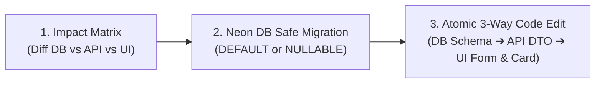

# 🎨 Stitch-to-CRUD Binder Skill (`stitch-to-crud-binder`)

Use this skill whenever you need to:
1. **Transform a Google Stitch prototype or static React UI into real CRUD features** backed by backend APIs and Neon PostgreSQL.
2. **Handle incremental requirement iterations (新增需求/改動欄位)** without breaking existing UI-to-Database connections or causing "搭錯線" (wire crossing) bugs.

---

## 🛑 The Core Rule: ZERO BLIND CODE EDITS

To prevent LLM hallucination, broken endpoints, and state mismatch, **NEVER directly edit React files or write fetch calls without completing Step 1 and Step 2**.

---

## 📋 Standard Operating Procedure (SOP)

### Mode A: Initial Connection (初次從 Stitch 轉真 CRUD)

#### Step 1: Scan & Audit UI Component (靜態審查)
Analyze the imported Stitch component in `frontend/src/` and extract:
1. **Mock Data Sources**: Look for `const [data, setData] = useState([...])` or hardcoded objects/arrays.
2. **User Actions (Triggers)**: Identify buttons (Submit, Delete, Edit, Filter, Search, Pagination).
3. **Form Fields**: Identify all input fields, textareas, selects, and toggles.

#### Step 2: Database Schema Alignment & Mapping Matrix (欄位映射矩陣)
Construct and present a **Field Mapping Matrix** to the user before writing any code:

```markdown
### 📊 Field Mapping Matrix

| UI Component Field | User Action | API Endpoint & Method | Neon DB Column | Type / Validation | Default / Nullable |
| :--- | :--- | :--- | :--- | :--- | :--- |
| `taskInput` (text) | Create | `POST /api/tasks` | `title` | `string` (required) | N/A |
| `categorySelect` | Filter / Create | `GET /api/tasks`, `POST` | `category_id` | `UUID` | Nullable |
| `isDone` (checkbox) | Toggle | `PATCH /api/tasks/:id` | `is_completed` | `boolean` | DEFAULT false |
| `createdAt` (badge) | Display | `GET /api/tasks` | `created_at` | `timestamp` | DEFAULT NOW() |
```

#### Step 3: Backend API & Service Layer Implementation (後端路由)
1. In `backend/src/`, create standard REST/RPC endpoint handlers.
2. Use **Zod** or strict type validation on `req.body` and `req.query` matching Neon DB columns.
3. Handle standard HTTP status codes (`200 OK`, `201 Created`, `400 Bad Request`, `404 Not Found`, `500 Server Error`).

#### Step 4: Frontend Decoupling & Hook Binding (前端真 CRUD 綁定)
1. **Extract API Client / Hook**: Create a clean hook or service (e.g. `useTasks.ts` with React Query, SWR, or standard `useEffect`/`fetch`).
2. **Replace Mock State with Real State**:
   - `data`: Replaced with real query response.
   - `isLoading`: Bind loading skeletons / spinner (preserve Stitch styling).
   - `isError`: Bind error banner / toast.
   - `isEmpty`: Show clean empty state when `data.length === 0`.
3. **Bind Mutations with Optimistic Updates / Invalidation**:
   - `handleCreate`: Call `POST` API -> prepend item or re-fetch.
   - `handleDelete`: Call `DELETE` API -> remove item from list.
   - `handleUpdate`: Call `PATCH/PUT` API -> update item state.

---

### Mode B: Incremental Requirement Iteration (迭代更新 / 欄位追加防斷線 SOP)

When a new requirement is introduced mid-project (e.g., adding `priority` or `due_date` to an existing table):



#### The 3-Way Atomic Edit Checklist:
1. **Step 1: Impact Matrix (影響面矩陣)**:
   - Output the exact diff across all 3 tiers (DB, API, UI).
2. **Step 2: Safe Neon DB Migration**:
   - ⚠️ **MANDATORY**: Any newly added column **MUST have a `DEFAULT` value or be `NULLABLE`**.
   - NEVER add a raw `NOT NULL` column without default on existing tables (it will instantly crash all legacy records and existing fetch calls).
   - Example: `ALTER TABLE tasks ADD COLUMN priority VARCHAR(20) DEFAULT 'medium';`
3. **Step 3: Atomic 3-Tier Code Sync**:
   - Update `types/database.ts` (shared interfaces).
   - Update backend router payload validation (`Zod` schema + SQL query).
   - Update frontend Form Input + Card/Table Display + Default Form State.

---

## 🛡️ Anti-Hallucination & Quality Checklist

- [ ] **Naming Casing Consistency**: Ensure `camelCase` (frontend) and `snake_case` (DB) conversions are handled cleanly in the API layer.
- [ ] **Null / Undefined Safety**: Ensure optional fields (e.g. `description?`, `avatar_url?`) use optional chaining (`item?.description`) to prevent React white-screen crashes.
- [ ] **No Dead Mock Data**: Remove all leftover mock arrays after real API connection is verified.
- [ ] **Preserve Stitch Styling**: Retain 100% of Tailwind classes, animations, and CSS layouts from Google Stitch while replacing only the data logic.
