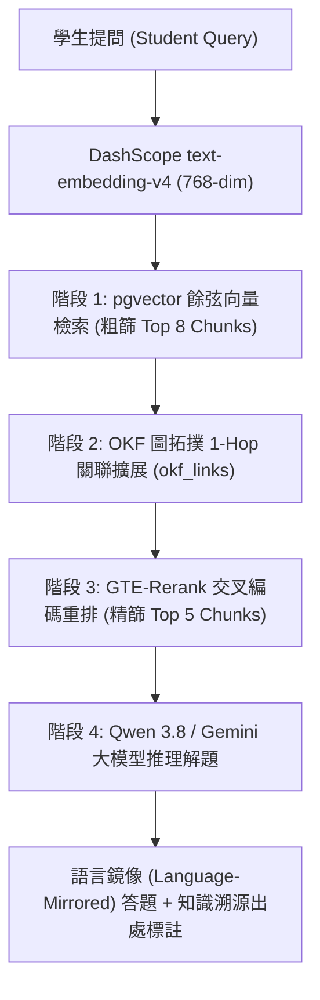

# ⚡ Tai Ping Mun Tech 雲端整合全棧 SaaS 啟動模板 (Starter Template)

> **Cloudflare Workers/Pages (React SPA) + Google Cloud Run (Node.js/Express) + Neon Serverless PostgreSQL + Multi-LLM (Qwen 3.8 / Gemini 3.8 / Gemma 4) + Google OKF Graph RAG**

本倉庫是一套已徹底打通**跨雲端整合、多模型推理、知識圖譜檢索 (Graph RAG)、資料庫連線池與自動化 CI/CD** 的全棧 SaaS 啟動基石。旨在讓日後開拓新產品時，**直接跳過所有基礎架構踩坑，5 分鐘內直入業務代碼開發**。

---

## 🏗️ 技術架構總覽 (Tech Stack Matrix)

| 層級 | 技術方案 | 部署平台 | 亮點特性 |
| :--- | :--- | :--- | :--- |
| **前端 (Frontend)** | React 18 + TypeScript + Vite | **Cloudflare Workers / Pages** | 雙環境部署 (`main` / `dev`)、SPA 404 回退、本機直推秒級生效 |
| **後端 (Backend)** | Express + Node.js + TypeScript | **Google Cloud Run (GCP)** | GitHub 觸發自動編譯 (Cloud Build)、ADC 原生身分驗證、非 JSON 防崩潰容錯 |
| **資料庫 (Database)** | Serverless PostgreSQL (pgvector) | **Neon Database** | 支援連線池 (`-pooler`)、SSL 嚴格連線、自帶健康診斷 CRUD 表 |
| **阿里千問 (Qwen)** | Alibaba Cloud Model Studio | **新加坡國際節點** | 支援 `qwen3.8-flash`、`qwen3.8-max`、`text-embedding-v4`、`gte-rerank` |
| **谷歌雙子座 (Gemini)** | Google Agent Platform / Vertex AI | **全球 REST 端點** | 採用 Cloud Run IAM ADC 憑證，解鎖 `gemini-3.1-flash-lite` 與 `gemini-3.8-flash`，無 429 限制 |
| **知識圖譜 (Graph RAG)** | Google OKF (Open Knowledge Format) | **Neon pgvector + 拓撲關聯** | 向量粗篩 + 1-Hop 拓撲概念擴展 + GTE-Rerank 精篩 + 語音/雙語導師輸出 |

---

## 🧭 跨平台環境變數配置指南 (Environment Variables Guide)

當開拓新 Project 時，需分別在 `frontend/.env.*` 與 `backend/.env.*` 填入對應的雲端金鑰與端點。以下為各平台取值步驟與位置對照：

### 1. 後端設定檔 (`backend/.env.development` / `backend/.env.production`)

| 變數名稱 (Key) | 平台來源 (Platform) | 控制台獲取路徑與步驟 (How to get it) |
| :--- | :--- | :--- |
| **`PORT`** | 本地系統 | 填 `8080` (Cloud Run 容器執行時會自動覆蓋注入，本地請固定為 8080)。 |
| **`FRONTEND_URL`** | Cloudflare Workers | 前端網址。Prod 填 `https://<project-name>.workers.dev`；Dev 填 `https://<project-name>-dev.workers.dev`。用於後端 CORS 安全跨域放行。 |
| **`DATABASE_URL`** | **Neon Console** (neon.tech) | 進入專案 Dashboard ➔ 點擊 **Connection Details** ➔ 選擇 **Connection string** ➔ 勾選 **Pooled connection** ➔ 複製字串 (必須含有 `sslmode=require`)。Dev 與 Prod 可選用不同分支 (Branch)。 |
| **`DASHSCOPE_API_KEY`** | **Alibaba Cloud Model Studio** | 登入 [DashScope 控制台 (國際版)](https://modelstudio.console.alibabacloud.com/) ➔ 點擊右上角 **API-KEY** ➔ 建立並複製以 `sk-` 開頭之密鑰。 |
| **`DASHSCOPE_BASE_URL`** | Alibaba Cloud | 填 `https://dashscope-intl.aliyuncs.com/compatible-mode/v1` (⚠️ 必須是 compatible-mode 端點才能調用 Qwen 3.8)。 |
| **`LLM_ROUTER_MODEL`** | Alibaba Cloud | 填 `qwen3.8-flash` (輕量、極速路由與日常對話)。 |
| **`LLM_COMPLEX_REASONING_MODEL`** | Alibaba Cloud | 填 `qwen3.8-max` (旗艦深度思考模型，自動解碼 reasoning_content)。 |
| **`RAG_EMBEDDING_MODEL`** | Alibaba Cloud | 填 `text-embedding-v4` (768 維度向量嵌入)。 |
| **`RAG_EMBEDDING_DIM`** | 系統參數 | 填 `768` (與 Neon 資料庫向量維度一致)。 |
| **`RAG_RERANK_MODEL`** | Alibaba Cloud | 填 `gte-rerank` (知識圖譜擴展後之精準重排模型)。 |
| **`GOOGLE_PROJECT_ID`** | **Google Cloud Console** | 登入 GCP 控制台 ➔ 頂部專案選單 ➔ 複製 **Project ID** (如 `certifyai-yes-college`)。Cloud Run 容器依賴此 ID 調用 Vertex AI，無需 API Key。 |
| **`GEMINI_MODEL`** | Google Cloud | 填 `gemini-3.1-flash-lite` (極速推論)。 |
| **`GEMINI_REASONING_MODEL`** | Google Cloud | 填 `gemini-3.8-flash` (高階推理)。 |
| **`OLLAMA_API_KEY`** | **Ollama Cloud** (可選) | [api.ollama.com](https://api.ollama.com) 取得，預設使用 `gemma4:31b-cloud`。 |
| **`R2_ACCOUNT_ID` / `R2_ACCESS_KEY_ID` / `R2_SECRET_ACCESS_KEY`** | **Cloudflare R2** (可選) | Cloudflare 側邊欄 **R2 Object Storage** ➔ 點擊 **Manage R2 API Tokens** ➔ 建立具備 Admin Read/Write 權限之 API Token 取得 Account ID 與金鑰。 |
| **`STRIPE_API_KEY` / `STRIPE_WEBHOOK_SECRET`** | **Stripe Dashboard** (可選) | 登入 Stripe 開發者後台 ➔ **API keys** 複製 Secret Key (`sk_test_...`)；**Webhooks** 添加端點獲取簽名金鑰 (`whsec_...`)。 |

---

### 2. 前端設定檔 (`frontend/.env.development` / `frontend/.env.production`)

| 變數名稱 (Key) | 平台來源 (Platform) | 控制台獲取路徑與步驟 (How to get it) |
| :--- | :--- | :--- |
| **`VITE_API_URL`** | **Google Cloud Run** | 登入 GCP Console ➔ **Cloud Run** ➔ 點擊對應服務 (`-dev` 或 `-git`) ➔ 頂部直接複製 **URL** (如 `https://<service-name>-<hash>.<region>.run.app`)。本地開發測試可填 `http://localhost:8080`。 |
| **`VITE_DEFAULT_LLM_PROVIDER`** | 前端偏好 | 填 `alibaba` (或 `google` / `ollama`)，控制進入 Chat UI 時預設選取之標籤。 |
| **`VITE_GOOGLE_CLIENT_ID`** | **GCP Credentials** (可選) | GCP ➔ **APIs & Services** ➔ **Credentials** ➔ 建立 **OAuth 2.0 Client ID** (Web application)。 |

---

## 🧠 OKF + Graph RAG 運作邏輯與檢索流程 (Hybrid Graph Architecture)

本模板內建 Google OKF (Open Knowledge Format v0.2) 標準之知識工程流水線。解決傳統純向量 RAG「斷章取義」與圖神經網路「查詢延遲過高」的痛點：



### 檢索四部曲詳解：
1. **階段 1：Vector Similarity 粗篩 (Broad Match)**
   * 用戶問題由 `text-embedding-v4` 轉為 768 維向量。
   * 透過 Neon 資料庫的 `pgvector` 餘弦距離索引 (`<=>`)，秒級自 `okf_chunks` 撈出關聯度最高的前 8 篇段落。
2. **階段 2：1-Hop 圖拓撲概念擴充 (Graph Expansion)**
   * 根據粗篩命中的 Concept IDs，從 `okf_links` 關係表順藤摸瓜拉出其父級概念、前置知識 (Prerequisites) 與相鄰關聯知識，將知識上下文完整補齊（避免碎片化理解）。
3. **階段 3：GTE-Rerank 精準重排 (Precision Filter)**
   * 圖擴展後會產生 15~20 篇候選段落，直接塞入 Prompt 會造成注意力分散（Lost in the Middle）並消耗大量 Token。
   * 透過阿里雲 `gte-rerank` 交叉編碼器 (Cross-Encoder) 進行語義強打分，精確過濾出最精華的 **Top 5** 篇內容。
4. **階段 4：導師人設生成與知識溯源 (Master Coach Generation)**
   * 自動鏡像提問者語言（廣東話 / 英文 / 繁體中文）。
   * 嚴格 Grounding 於檢索出的 OKF 知識塊，並在回答尾部附帶結構化出處導航（來源文件、頁碼、章節標題）。

---

## 🤖 專屬智能體技能庫 (.agents/skills)

倉庫預置 9 款專為 SaaS 生產力與知識工程打造的自動化技能（Skills）：

| 技能名稱 (Skill) | 職能與觸發時機 (Purpose & Trigger) | 核心技術亮點 |
| :--- | :--- | :--- |
| **`gcp-cloudrun-provisioner`** | **GCP Cloud Run 與 CI/CD 零出網費開箱部署**。從零建立新服務、設定 GitHub 自動化 CI/CD Trigger、或審計 GCP 資源時使用。 | 強制「同區三位一體」(Cloud Run / Artifact Registry / Cloud Build) 杜絕跨洋傳輸費、鎖定 gcloud CLI 區域、微預算警報。 |
| **`env-sync`** | **跨平台環境變數動態同步**。當在本地修改 `.env` 需推送到雲端時使用。 | 動態讀取 GCP Project 與服務名、安全遮罩預覽 (`--dry-run`)、秒級更新 Cloud Run。 |
| **`okf-knowledge-chatbot`** | **OKF 知識對話與導師推理引擎**。處理學生提問、考試答疑時使用。 | 4 階段檢索 (pgvector + 1-Hop + GTE-Rerank)、廣東話/英文雙語自動鏡像、LaTeX 公式渲染。 |
| **`okf-knowledge-builder`** | **OKF 知識庫工程構建**。當上傳 PDF / Markdown / 講義需切片建圖時使用。 | 多格式解析帶頁碼追蹤、目錄提取、雙向圖合成、DashScope 768-dim 批次向量化。 |
| **`okf-dialogue-memory`** | **動態對話記憶與雙時態知識演化**。監聽對話狀態變更與概念更新。 | 語意探針檢測、Bi-temporal 時間戳關聯、生成 `SUPERSEDES` 邊並自動歸檔舊知識。 |
| **`stitch-to-crud-binder`** | **Google Stitch / 原型代碼綁定**。將靜態 React UI 轉為真實 API CRUD 時使用。 | 自動生成欄位映射矩陣 (Field Mapping Matrix)、防呆錯誤處理、安全串接 Neon DB。 |
| **`db-sync`** | **題庫與結構化數據同步專員**。當有 Markdown 題目批次需入庫時使用。 | 解析 JSONB 選項陣列、防止重複寫入 (Upsert)、安全無 hardcode 連線。 |
| **`app-grill-planner`** | **需求極限審問與架構藍圖制定**。在啟動全新複雜功能前使用。 | 決策樹確認、防止 AI 上下文失憶、自動固化規格至 `z_doc/active_spec.md`。 |
| **`zdoc-maintainer`** | **工程文檔維護者**。在功能完成或踩坑後自動記錄進度與經驗。 | 嚴格三段式根因分析標準（現象 ➔ 根因 ➔ 防禦實踐）、自動推進 Phase 編號。 |

---

## 🚀 5 分鐘開箱：如何用此 Template 建立全新 App？

當你需要砌一個新 App 時，只需按照以下 5 步即可開箱運行：

### 第一步：複製倉庫並初始化
```bash
# 1. 複製或 Clone 此 Template 倉庫至你的新專案目錄
git clone https://github.com/edmondysagor/certifyai_yes_college.git my-new-saas
cd my-new-saas

# 2. 安裝前後端依賴
cd frontend && npm install
cd ../backend && npm install
cd ..
```

### 第二步：全局替換關鍵字 (Search & Replace Matrix)
在 VS Code / 編輯器中使用全局搜尋並替換以下標記：

| 舊值 (Template 原值) | 替換為你的新專案值 | 涉及檔案 |
| :--- | :--- | :--- |
| `certifyai-yes-college` | `<你的新專案名稱，如 my-new-saas>` | `frontend/wrangler.jsonc`, `package.json`, `backend/.env.*`, `frontend/.env.*` |
| `certifyai-yes-college-git` | `<新專案 Cloud Run 生產服務名>` | `backend/.env.production`, `frontend/.env.production` |
| `certifyai-yes-college-dev` | `<新專案 Cloud Run 開發服務名>` | `backend/.env.development`, `frontend/.env.development` |
| `Tai Ping Mun Tech` | `<你的新產品品牌名稱>` | `frontend/src/App.tsx`, `backend/src/index.ts` |

### 第三步：配置資料庫 (Neon DB)
1. 前往 [Neon 控制台](https://console.neon.tech) 建立新專案。
2. 開啟 **SQL Editor**，複製並執行 [`backend/database/schema.sql`](backend/database/schema.sql) 建立初始測試資料表。
3. 取得帶有 `sslmode=require` 的連線字串。

### 第四步：設定前後端環境變數
參考上方 **「跨平台環境變數配置指南」**，複製並填妥：
* `backend/.env.development` 與 `backend/.env.production`
* `frontend/.env.development` 與 `frontend/.env.production`

### 第五步：一鍵同步環境變數至 Google Cloud Run 並部署前端
```bash
# 1. 一鍵安全推送環境變數至 Cloud Run (動態讀取專案與密鑰，免手動逐項複製)
npm run sync:dev    # 同步至開發環境 Cloud Run 服務
npm run sync:prod   # 同步至生產環境 Cloud Run 服務

# 2. 構建並發佈前端至 Cloudflare Workers (本機直推秒級生效)
npm run deploy      # 標準一鍵發佈 (適用於 CI/CD 與預設專案)
npm run deploy:dev  # 發佈至開發環境 (certifyai-yes-college-dev)
npm run deploy:prod # 發佈至生產環境 (certifyai-yes-college)
```

---

## 🛠️ 常用指令清單 (Developer Cheatsheet)

| 指令 | 說明 |
| :--- | :--- |
| `npm run build` | 編譯前端 React SPA (`frontend/dist/`) |
| `npm run deploy` | **【大一統發佈】** 一鍵編譯並發佈前端至 Cloudflare Workers (CI/CD 與通用預設) |
| `npm run deploy:dev` | 發佈前端靜態資源至 Cloudflare Dev 站點 |
| `npm run deploy:prod` | 發佈前端靜態資源至 Cloudflare Prod 站點 |
| `npm run sync:dev` | **【核心自動化】** 一鍵同步本地 `backend/.env.development` 至 Cloud Run Dev 服務 |
| `npm run sync:prod` | **【核心自動化】** 一鍵同步本地 `backend/.env.production` 至 Cloud Run Prod 服務 |
| `cd backend && npm run dev` | 本地啟動後端 Express API (`http://localhost:8080`) |
| `cd frontend && npm run dev` | 本地啟動前端 Vite 開發伺服器 (`http://localhost:5173`) |

---

## 🛡️ 避坑重點速查 (Quick Lessons Learned)
1. **Google Gemini**：在 Cloud Run 上無需傳入 API Key，容器直接以 ADC 服務帳號權限直連全球端點 `locations/global/publishers/google/models/...`，徹底規避 AI Studio 429 扣費阻斷。
2. **Alibaba Qwen**：調用最新 `qwen3.8-flash` / `qwen3.8-max` 必須使用 `https://dashscope-intl.aliyuncs.com/compatible-mode/v1` 端點。
3. **Cloudflare Workers Monorepo**：前端設定收納於 `frontend/wrangler.jsonc`，Cloudflare Dashboard 中的 Root directory 務必填寫 `/frontend`，Build command 填 `npm run build`，Deploy command 填 `npm run deploy`。
4. **防禦性解析**：全棧禁止直接 `res.json()`，一律先 `res.text()` 再 `JSON.parse`，防止伺服器冷啟動返回 HTML 頁面時引發語法崩潰。
