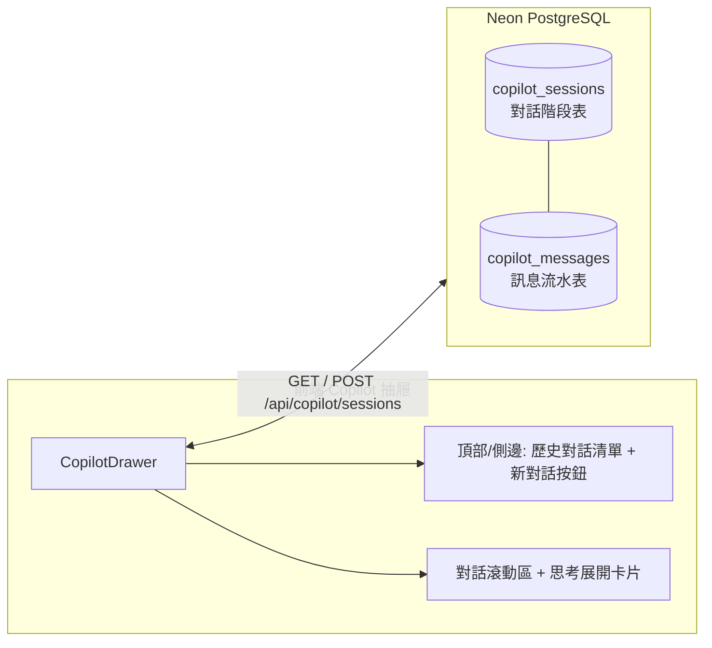

# 🧠 AI Copilot 與 OKF + Graph RAG 知識庫完整系統規格 (Aligned System Spec)

> **版本**：v1.2 (納入 Information 知識來源定案版)  
> **更新日期**：2026-09-11  
> **系統定位**：Projectson AI PM Hub  
> **核心標準**：Google OKF v0.2 / Hybrid Graph RAG / Actionable Agentic PM / Zero-Token Cost Control

---

## 📌 一、核心架構與檢索分工 (Core Architecture & Hybrid Retrieval)

### 1. 雙軌檢索分工：SQL 精準查詢 vs 向量/圖譜語意檢索
全系統嚴格劃分「結構化工作態」與「非結構化知識態」，避免盲目 Embedding 導致的 Token 浪費與資料滯後：

| 數據維度 | 包含內容 | 檢索與處理機制 | 成本與延遲 |
| :--- | :--- | :--- | :--- |
| **工作態數據 (90%)** | 任務狀態、指派人、截止日、5 層 Traceability 樹狀鏈、卡片數量、日常工單的 `item_content` (BlockNote) 與 `item_comment` (Task, Story, Req, Bug 等) | **純 SQL 查詢 (PostgreSQL / JSONB 原生查詢)**<br>AI 透過 Tool Calling 直讀直寫資料庫。 | **0 Token 耗費**<br>< 10ms 即時響應<br>100% 精準無幻覺 |
| **知識態大數據來源 (10%)** | 1. 外部上傳的 PDF/DOCX/PRD 規格書<br>2. 內部工單 **`ℹ️ Information`** (技術背景、外部 API 規格、環境配置、SOP 備忘)<br>3. 正式定案的 **`💡 Decision`** (決策理由與權衡)<br>4. 已解決的 **`⚠️ Bottleneck`** (Root Cause 排查心得)<br>5. 專案章程 **`📜 Charter`** (專案目標與願景)<br>6. 對話動態規則 (`okf-dialogue-memory`) | **雙軌並行**：<br>1. 日常精準查詢走 SQL 直讀<br>2. 當 Information 建立/更新完成時，非同步提取 BlockNote 文本進行 DashScope 768-dim 向量化，作為 Graph RAG 跨專案語意檢索來源。 | **極低成本**<br>百萬 Token 約 $0.02 USD<br>語意檢索能力極高 |

---

### 2. 工單更新 (Content / Comment) 的觸發與分流規則
當用家修改工單內容或新增評論時，系統採取極致清晰的三大分流：

```
工單更新 (修改 Content / 新增 Comment)
                 │
                 ▼
         判斷工單類型是什麼？
                 │
      ┌──────────┼──────────────────────────────┐
      ▼          ▼                              ▼
【普通工單】  【資訊工單 Information】       【決策/阻礙工單 Decision, Bottleneck】
(Task/Story)   (技術背景/SOP/API配置)          (架構權衡 / Root Cause)
      │          │                              │
      ▼          ▼                              ▼
 🚀 僅存 DB    🚀 即時寫入 DB                   判斷狀態是否為 Approved / Resolved？
 (0 Token)       + 非同步更新 OKF/RAG 向量庫          │
                 (讓 AI 具備語意長文檢索能力)    ├── 是 ──► 🧠 觸發非同步 OKF/RAG 沉澱
                                                └── 否 ──► 🚀 僅存入 Neon DB (草稿期純 SQL 查)
```

---

## 📌 二、多用家並發與情報對齊 (Concurrency & Proactive Delta Alerting)

### 1. 唯一客觀時間基準：`updated_at` (徹底捨棄 Flag)
* **無狀態時間軸 (Stateless Time-window)**：
  * 不在資料庫中維護容易產生 Race Condition 的 `inform_ind` 或單一知悉時間戳。
  * 以 PostgreSQL 原生觸發器維護的 **`updated_at` (TIMESTAMPTZ)** 作為唯一客觀基準（Ground Truth）。
* **多用家隔離查詢**：
  * 當任何用家進入專案同 AI 傾偈時，AI 直接以當前時間往前推算（例如 `updated_at >= NOW() - INTERVAL '24 HOURS'`），精準列出最近被推進／被留言的工單動態，多個用家同時使用各自獨立，完全不打交。

### 2. 主動式智能提醒 (Proactive Delta Alerting)
* **自然語言概念對齊 (Entity Linking)**：
  * 用家無需背誦 Display Code，隨意問：「*個結帳畫面點呀？*」
  * AI 自動透過 SQL 比對命中 `[TTG-5]`，並依據最新 `updated_at` 發現 Chris 在 10 分鐘前剛留了 Comment 並將狀態推至 `Review`。
* **主動匯報最新進展**：
  * AI 不僅回答現況，還會主動帶出最新動態：「*順帶提醒你，Chris 喺 10 分鐘前啱啱將狀態推至 `Review`，並留言提到測試環境已部署囉！*」

---

## 📌 三、多租戶安全性與文件管理 (Multi-Tenant & Source Hub)

### 1. 嚴格的多租戶數據隔離 (Strict Multi-Tenant Isolation)
* **租戶防線 (Workspace Boundary)**：不同公司（Workspace）之間數據**絕對隔離**。任何 SQL、pgvector 近似搜尋與圖譜遍歷，後端**強制鎖死** `WHERE workspace_uid = $current_user_workspace_uid`。
* **知識繼承層級 (Scope Hierarchy)**：
  * **Workspace 全域知識**：公司級別通用規範（如 Coding Standard、通用 API 格式），該 Workspace 內所有 Project 自動繼承。
  * **Project 專屬知識**：專屬該專案的 PRD 與需求，跨 Project 預設不干擾，但可透過 AI 智慧建議過往歷史根因。

### 2. 文件管理模式 (NotebookLM-Style Sources vs 拒絕傳統檔案總管)
* **摒棄傳統樹狀資料夾總管**：避免階層搬移的認知負擔，RAG 檢索核心為語意與 Metadata。
* **採用「來源卡片庫 (Source Cards)」**：
  * 卡片顯示：檔名、大小、頁數、解析狀態 (`🟢 已完成索引 (xx 節點)`)。
  * 支援單項來源啟用/停用勾選（Source Toggles），精準控制 AI 本次對話的參考範圍。
  * 支援一鍵溯源（點擊引用標籤查看原文段落與頁碼）。

### 3. UI 入口佈局 (UI Entry Point)
* **Level 2 專案詳情頁新增 Tab**：
  * 在現有 Tabs 列新增 **`📁 知識文件 / 來源 (Sources)`**（附帶數量計數，例如 `📁 知識文件 (3)`）。
  * 點入後提供拖放上傳區（Drag & Drop Zone）及 NotebookLM 風格的卡片清單。
* **全域 AI Copilot 抽屜 (Side Drawer)**：
  * 懸浮按鈕或頂部常駐入口，點擊自右側滑出對話面板，支援全螢幕隨時召喚。

---

## 📌 四、Actionable AI Agent 與工程容錯機制 (Agentic PM & Dual-Track Robustness)

### 1. 可執行工單的 AI 專案經理 (Action Preview & Human-in-the-loop)
* **AI 具備工單寫入與編輯能力**：
  * 透過 Tool Calling / Action 語意解析調用後端 API（`create_item`, `update_item`, `batch_create_hierarchy` 等）。
* **支援場景**：
  * **對話式開單**：「*幫我喺 TTG-2 下面開多個 Requirement: 支援八達通*」
  * **對話式指派與狀態變更**：「*幫我把 TTG-12 指派比 Edmond，並將狀態改為 In Progress*」
  * **PRD 一鍵拆解**：讀取知識庫規格，自動生成 Epic -> Story -> Task，批次寫入 Traceability 矩陣。
* **Human-in-the-loop 預覽確認**：
  * Copilot 對話框輸出清晰的「Action Preview（工單操作預覽卡片）」，列明目標工單、類型、標題或指派人，用家點擊「一鍵套用至專案 (Apply)」後才正式發起 API 寫入資料庫。

### 2. 雙重標識匹配與成員名稱容錯解析 (Defensive UUID & Display Code Resolution)
為徹底杜絕大模型生成 UUID 幻覺或 Markdown 格式污染導致的 PostgreSQL 外鍵錯誤：
* **工單目標鎖定**：`PATCH /api/items/:uid` 原生支援 **`item_uid` (UUID)** 與 **`item_display_code` (如 `TTG-12`)** 雙重查詢，自動清洗 `*`、`[`、`]` 等 Markdown 符號。
* **成員指派自動轉換 (Name-to-UUID)**：若 `item_follow_by` 傳入成員姓名（如 `"Edmond"` 或 `"Edmond Chan"`），後端自動在 `public.member` 進行模糊比對並替換為正確的 `member_uid`；若為無效值則安全忽略，防止寫入非 UUID 字串而崩潰。
* **即時跨組件事件聯動**：Copilot 套用成功後派發 `projectson_item_updated` 全域事件，即時通知已開啟的 `ItemDrawer` 重新獲取資料，實現左側「負責人」與看板同步響應。

---

## 📌 五、AI Chat History 對話持久化架構 (Session Continuity & Dialogue Memory)

為解決瀏覽器重新整理「記憶遺失」問題，並為 Google OKF v0.2 提供對話提煉來源，系統導入標準兩層對話持久化設計：



### 1. 資料庫結構 (Database Schema)
* **`public.copilot_sessions`**：
  * `session_uid` (UUID, PK)
  * `workspace_uid` (UUID, FK)
  * `project_uid` (UUID, 可為 NULL 代表工作區全域對話)
  * `member_uid` (UUID, 發起成員)
  * `session_title` (VARCHAR, 自動由首輪對話摘要生成)
  * `created_at`, `updated_at`
* **`public.copilot_messages`**：
  * `message_uid` (UUID, PK)
  * `session_uid` (UUID, FK REFERENCES copilot_sessions ON DELETE CASCADE)
  * `sender` (`user` | `ai`)
  * `message_text` (TEXT)
  * `reasoning_content` (TEXT, 深度思考過程記錄)
  * `action_preview` (JSONB, 當時關聯之操作卡片)
  * `created_at`

### 2. OKF 雙時態對話提煉 (Dialogue Memory Feeding)
* 對話歷史作為 OKF 背景提煉引擎的核心輸入。當團隊在對話中達成共識（例如「*決定採用 Neon DB*」），自動識別並轉化為 `okf_concepts` 與 `okf_links`（`SUPERSEDES` 關聯），沉澱入專案知識庫。

---

## 📌 六、多模型切換矩陣與 Thinking Mode 推理機制 (Multi-Model & Reasoning)

### 1. 支援的模型矩陣 (Model Matrix)
用戶可於 Copilot 抽屜頂部隨時無縫切換當前對話所使用的 LLM：

| 模型名稱 | 標識 (Model ID) | 特性與推薦場景 | 預設狀態 |
| :--- | :--- | :--- | :--- |
| **⚡ Qwen 3.8 Flash** | `qwen3.8-flash` | 極速響應 (< 1s)、超低延遲，適合日常工單查詢、快速指派與開單 | **預設模型** |
| **🚀 Qwen 2.5 Plus** | `qwen-plus` | 均衡型主力模型，適合規格長文分析、複雜 Traceability 關係梳理 | 可選 |
| **🧠 Qwen Max** | `qwen-max` | 旗艦級大模型，具備超強邏輯與架構決策推演能力 | 可選 |
| **🔮 DeepSeek V3** | `deepseek-v3` | 阿里雲 DashScope 託管通用開源模型，編程與敏捷架構理解強 | 可選 |
| **🎯 DeepSeek R1** | `deepseek-r1` | 專精長思維鏈 (CoT) 深度邏輯推理與根因瓶頸排查 | 可選 |

### 2. 深度思考模式 (Thinking Mode Toggle)
* **前端交互**：Copilot 抽屜頂部提供 **`🧠 深度思考模式`** 開關（Toggle Switch）。
* **後端處理**：
  * 開啟時注入長思維鏈推理 Prompt，並調整溫度參數。
  * 後端自動分離 `<think>...</think>` 思考內容與正式回答。
* **前端可摺疊卡片**：
  * 思考內容以優雅的紫灰色摺疊卡片（`🧠 思考過程 (點擊展開/收合)`）呈現於正式回答上方，用戶可清晰檢視 AI 的分析思路。

---

## 🚀 七、後續實施 Roadmap (Next Steps)

1. **Phase 4.1 (OKF Schema & Vector Infrastructure)**：已完成 ✅
2. **Phase 4.2 (Project Sources UI & API)**：已完成 ✅
3. **Phase 5.1 & 5.2 (Actionable Copilot, Dual-Track Robustness & Live Sync)**：已完成 ✅
4. **Phase 5.3 (Multi-Model Switcher & Thinking Mode)**：已完成 ✅
5. **Phase 5.4 (Proposal Canvas & Atomic Batch Transaction)**：已完成 ✅
6. **Phase 5.5 (Schema-Aware Def Tools & Read-Only SQL Sandbox)**：已完成 ✅
7. **Phase 5.6 (AI Chat History Persistence & Session Management)**：即將實裝 🚀


